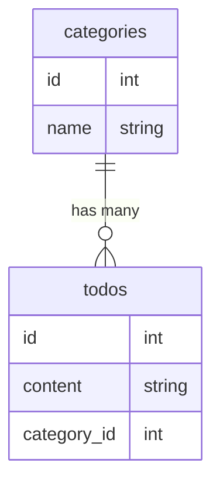

# COACHTECH TODOアプリ

このアプリケーションは、COACHTECH の学習課題として作成した  
「TODO 管理アプリ」です。

タスクの新規作成・編集・削除といった基本的な CRUD 機能に加えて、  
カテゴリーによる分類、キーワード検索、バリデーションなど、  
実務でもよく使われる機能を実装しています。

Laravel の MVC 構造を理解することを目的としており、  
コントローラ・ルーティング・Blade テンプレート・Eloquent ORM を  
実際に触れながら学習できる構成になっています。

本アプリでは Laravel Fortify を使用してログイン機能を導入していますが、  
TODO 管理機能はユーザー単位での紐づけを行わないため、  
ER 図には認証用の users テーブルを含めていません。

## 作成者

山口 琴音

## 使用技術

- PHP 8.2  
- Laravel 10.x  
- MySQL 8.x  
- Docker / Laravel Sail  
- Node.js 18.x（Vite / npm）

## ER図



## 開発環境URL

http://localhost

## 動作環境

- Docker Desktop  
- Laravel Sail  
- MySQL 8  
- Node.js / npm  
- Vite  

## 環境構築手順

1. **リポジトリをクローン**

    ```bash
    git clone https://github.com/osakana-works/TODO-app3.git
    cd TODO-app3
    ```

2. **.envファイルの準備**

    `.env.example` をコピーして `.env` を作成し、  
    DB 接続情報を環境に合わせて設定。

    ```bash
    cp .env.example .env
    ```

3. **Composer依存パッケージのインストール**

    ```bash
    ./vendor/bin/sail composer install
    ```

4. **Laravel Sailの起動**

    ```bash
    ./vendor/bin/sail up -d
    ```

5. **アプリケーションキーの生成**

    ```bash
    ./vendor/bin/sail artisan key:generate
    ```

6. **データベースのマイグレーションと初期データ投入**

    ```bash
    ./vendor/bin/sail artisan migrate --seed
    ```

7. **フロントエンドのビルド**

    ```bash
    npm install
    npm run dev
    ```

8. **アプリケーションへのアクセス**

    http://localhost  
    または  
    http://localhost:8080

## テスト実行

```bash
./vendor/bin/sail artisan test
```

## 機能一覧

- TODO の新規作成  
- TODO の一覧表示  
- TODO の編集  
- TODO の削除  
- カテゴリー選択  
- キーワード検索  

