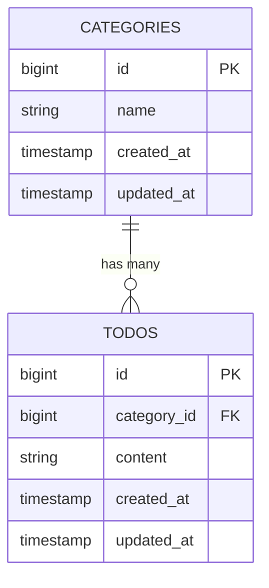

# COACHTECH TODOアプリ

このアプリケーションは、COACHTECH の学習課題として作成した  
「TODO 管理アプリ」です。

タスクの新規作成・編集・削除といった基本的な CRUD 機能に加えて、  
カテゴリーによる分類、キーワード検索、バリデーションなど、  
実務でもよく使われる機能を実装しています。

Laravel の MVC 構造を理解することを目的としており、  
コントローラ・ルーティング・Blade テンプレート・Eloquent ORM を  
実際に触れながら学習できる構成になっています。

本アプリでは Laravel Fortify を使用してログイン機能を導入していますが、  
TODO 管理機能はユーザー単位での紐づけを行わないため、  
ER 図には認証用の users テーブルを含めていません。

---

## 作成者

山口 琴音

---

## 使用技術

- PHP 8.2  
- Laravel 10.x  
- MySQL 8.x  
- Docker / Laravel Sail  
- Node.js 18.x（Vite / npm）  
- Tailwind CSS 3.x  

---

## ER図



---

## 開発環境URL

http://localhost

---

## 動作環境

- Docker Desktop  
- Laravel Sail  
- MySQL 8  
- Node.js / npm  
- Vite  
- Tailwind CSS  

---

# 環境構築手順（Clone した場合）

## 1. リポジトリをクローン

```bash
git clone https://github.com/osakana-works/TODO-app3.git
cd TODO-app3
```

---

## 2. .envファイルの準備

```bash
cp .env.example .env
```

以下の DB 設定になっていることを確認します。

```
DB_CONNECTION=mysql
DB_HOST=mysql
DB_PORT=3306
DB_DATABASE=laravel
DB_USERNAME=sail
DB_PASSWORD=password
```

---

## 3. Composer依存パッケージのインストール（Docker 経由）

```bash
docker run --rm \
    -u "$(id -u):$(id -g)" \
    -v "$(pwd):/var/www/html" \
    -w /var/www/html \
    laravelsail/php82-composer:latest \
    composer install
```

---

## 4. Laravel Sail の起動

```bash
./vendor/bin/sail up -d
```

---

## 5. アプリケーションキーの生成

```bash
./vendor/bin/sail artisan key:generate
```

---

## 6. データベースのマイグレーションと初期データ投入

```bash
./vendor/bin/sail artisan migrate --seed
```

---

# Tailwind CSS
---

## 7. フロントエンドのセットアップ

```bash
./vendor/bin/sail npm install
```

---

## 8. Tailwind CSSのインストール

```bash
./vendor/bin/sail npm install -D tailwindcss@^3.4.0 postcss autoprefixer
```

---

## 9. Vite 開発サーバーの起動

```bash
./vendor/bin/sail npm run dev
```

---

## 10. アプリケーションへのアクセス

- http://localhost  
- http://localhost:8080（phpMyAdmin を追加している場合）

---

# テスト実行

```bash
./vendor/bin/sail artisan test
```

---

# 機能一覧

- TODO の新規作成  
- TODO の一覧表示  
- TODO の編集  
- TODO の削除  
- カテゴリー選択  
- キーワード検索  
